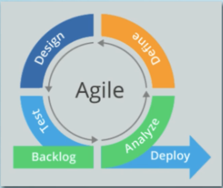
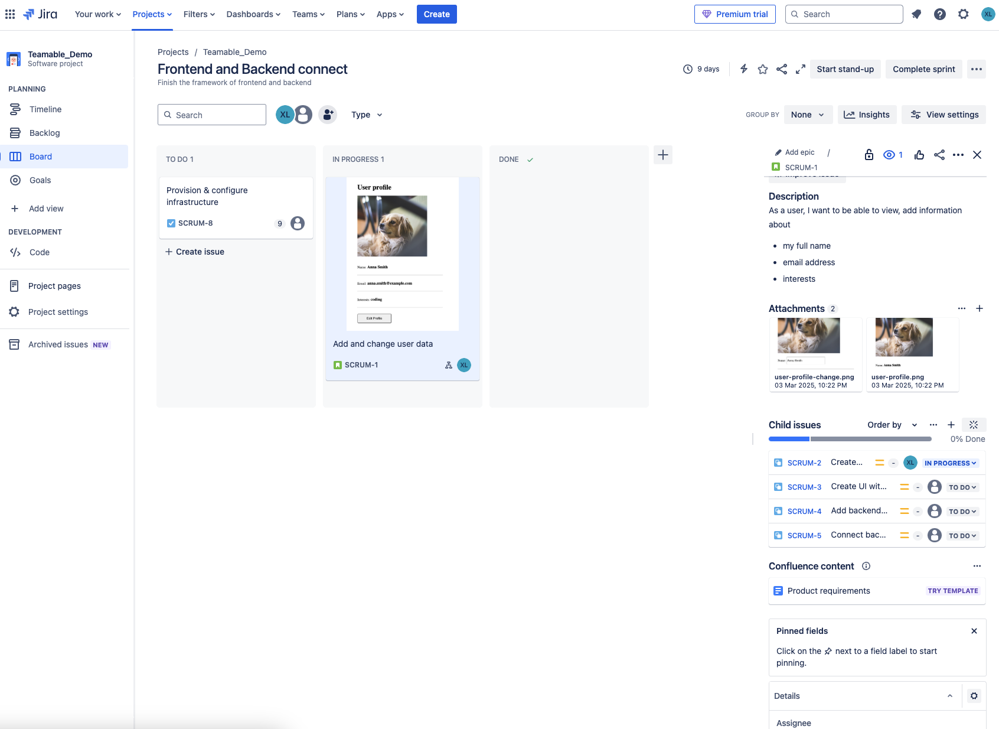
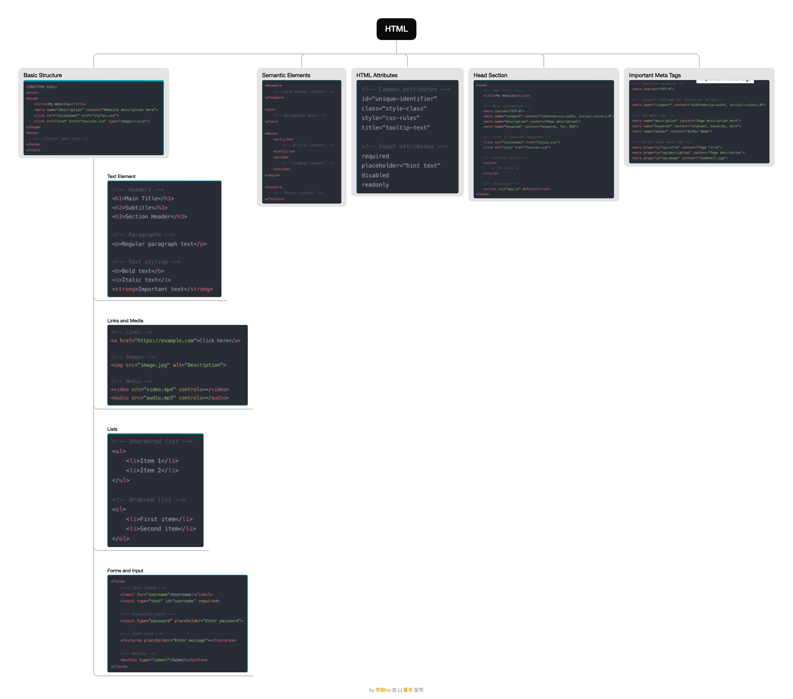
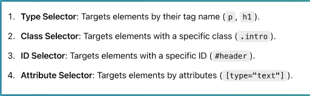
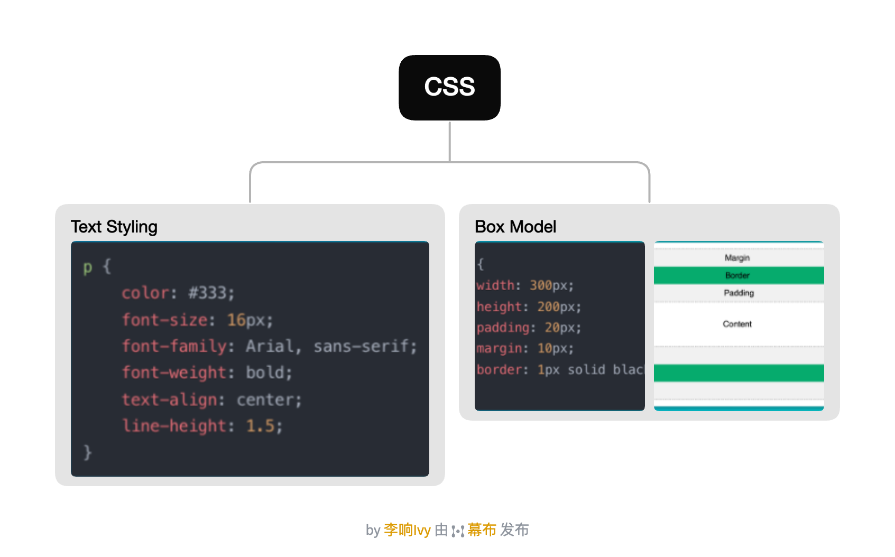
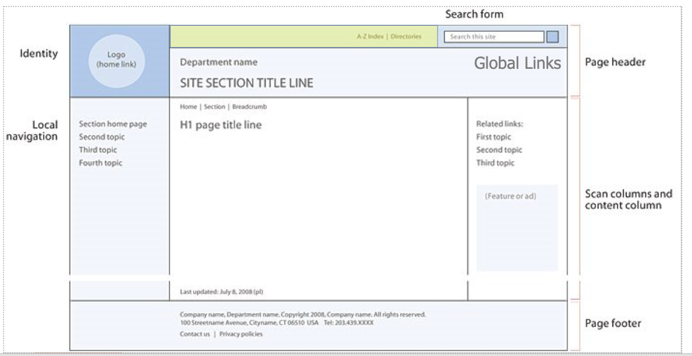
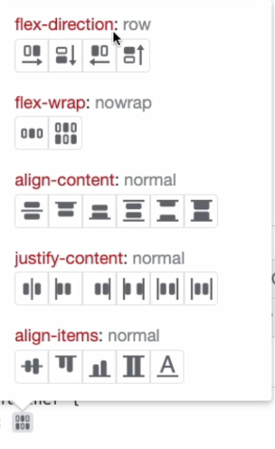

# Table of Contents
0. [Backlog and Scrum Board in Jira](#0-backlog-and-scrum-board-in-jira)
    - 0.1 [Issue](#01-issue)
        - 0.1.1 [Child Issue](#011-child-issues)
    - 0.2 [UI Mock](#02-ui-mock)
    - 0.3 [Backlog to Sprint](#03-backlog-to-sprint)
1. [Web Development with HTML, CSS, and JavaScript](#1-web-development-with-html-css-and-javascript)
    - 1.1 [JavaScript](#11-javascript)
        - 1.1.1 [Conditionals & Comparators](#111-conditionals--comparators)
            - 1.1.1.1 [== value and === value and data type ](#1111--and--equality-of-value-and-data-type)
            - 1.1.1.2 [if else statement](#1112-if-else-statement)
            - 1.1.1.3 [!== not equal](#1113--not-equal)
            - 1.1.1.4 [logical operators (&, ||, !)](#1114-logical-operators)
        - 1.1.2 [Objects](#112-objects-in-javascript)
            - 1.1.2.1 [Acess and Modify Objects](#1121-access-and-modify-objects)
        - 1.1.3 [Array](#113-arrays)
        - 1.1.4 [Loops](#114-loops)
        - 1.1.5 [Built-in Functions](#115-built-in-functions)
            - 1.1.5.1 [Built-in Functions in Data Types](#1151-built-in-functions-on-different-data-types)
            - 1.1.5.2 [Examples about date objects and boolean var](#1152-examples-to-transform-with-functions)
    - 1.2 [HTML](#12-html)
        - 1.2.1 [HTML Elements](#121-html-elements)
            - 1.2.1.1 [HTML Common Attributes](#1211-html-common-attributes)
            - 1.2.1.2 [HTML Inline Elements](#1212-html-inline-elements)
            - 1.2.1.3 [HTML Block Elements](#1213-html-block-elements)
        - 1.2.2 [HTML head tags](#122-html-head-tags)
    - 1.3 [CSS](#13-css)
        - 1.3.1 [`<style>` elements for Inline and Internal](#131-style-element-inline-and-internal)
            - 1.3.1.1 [Selector](#1311-selector)
            - 1.3.1.2 [CSS Properties](#1312-css-properties)
        - 1.3.2 [Website Layout](#132-website-layout)
            - 1.3.2.1 [Flexbox Positioning](#1321-flexbox-positioning)
        - 1.3.3 [Background Colors](#133-background-colors)
        - 1.3.4 [Semantic Elements](#134-semantic-elements)
    - 1.4 [Add JavaScript to HTML](#14-add-javascript-to-html)
        - 1.4.1 [OnClick Event](#141-onclick-event)
            - 1.4.1.1 [Write Create Post Form](#1411-write-create-post-form)
            - 1.4.1.2 [Add buttons to the Form](#1412-add-buttons-to-the-form)
        - 1.4.2 [Style Button on Hover](#142-style-button-on-hover)
        - 1.4.3 [DOM - Document Object Model](#143-dom---document-object-model)
        - 1.4.4 [Extract JS code into own JS file](#144-extract-js-code-into-own-js-file)
    - 1.5 [JavaScript Framework](#15-javascript-frameworks)
        - 1.5.1[Framework vs Libraries](#151-frameworks-vs-libraries)
            - 1.5.1.1[Frameworks](#1511-frameworks)
            - 1.5.1.2[Libraries](#1512-libraries)
        - 1.5.2[Version Scheme](#152-version-scheme)
        - 1.5.3[npm Registry](#153-npm-registry)
            - 1.5.3.1[Key Concepts for npm Registry](#1531-key-concepts-for-npm-registry)
            - 1.5.3.2[Package Manager](#1532-package-manager)
        - 1.5.4[npm CLI](#154-npm-cli)
            - 1.5.4.1[Key Conceptys for npm Registry](#1531-key-concepts-for-npm-registry)
            - 1.5.4.2[Package json](#1542-packagejson)
            - 1.5.4.3[Basic CLI commands](#1543-basic-cli-commands)

# 0. Backlog and Scrum Board in Jira
<div style="text-align: center;">
    
</div>

## 0.1 Issue
- Unit of work
- Will be traced through the workflow from creation to completion

Types:
- story: also called "user story", requirement expressed using **non-technical language**, and it is usually a larger parent work item, which is broken down to smaller tasks
- Task: a more technical description, more specific, describing a single unit of work
- Bug: a problem, which prevents product from function correctly

### 0.1.1 Child Issues
- Child issue **sits below** another issue e.g. a subtask

## 0.2 UI Mock
- A realistic representation or **visual draft** of the design of a website
- Reflects the app's design elements, like color scheme, images, typography, buttons

## 0.3 Backlog to Sprint
- Backlog collects all user stories or tasks or bugs, then review the list to prioritise the first 3
- Create Sprint to set timeline, plan the sprint and set the goal which is going to be done in the Sprint
- Development team decides how many tasks they can implement in 1 sprint

Jira Sprint and Backlog demo

<div style="text-align: center;">
    
</div>

# 1. Web Development with HTML, CSS and JavaScript
## 1.1 JavaScript

### 1.1.1 Conditionals & Comparators

#### 1.1.1.1 == and === (equality of value and data type) 
== equality of value

=== equality of value and data type
```javascript
var age = 30
age == 30
age == "30"
// the output will be true
age === "30"
// the output will be false, becuase the data types are not the same
```

#### 1.1.1.2 if else statement
```javascript
var totalPrice = 19;
var shippingCost;

if (totalPrice > 20) {
    shippingCost = 0
} else {
    shippingCost = 5
}

//more conditions
if (totalPrice <= 10) {
    shippingCost = 5
} else if (totalPrice <= 20) {
    shippingCost = 3
} else {
    shippingCost = 0
}
```
#### 1.1.1.3 !== not equal
```javascript
if (userMembership !== "premium") {
    // show user non-premium contents
    // recommend premium upgrade
} else {
    // show premium contents
}
```

#### 1.1.1.4 logical operators (&, ||, !)
```javascript
if (!(totalPrice > 20 || amazonPrime === true)) {
    // calcualte the shipment cost
} else {
    // free
}
```

### 1.1.2 Objects in JavaScript

**Data Type: Object**
- Used to group related information
- Unordered collection of **key-value pairs** (also called "properties")
- object properties can be **ANY** data types

```javascript
var person = {
    firstName: "Ivy",
    lastName: "Li"
}
```

#### 1.1.2.1 Access and modify objects
```javascript
person.firstName

// modify objects
person.firstName = "Xiang"

// add new key-value pair
person.gender = "female"

// remove elements from objects
delete person.gender
// it will output true if successful

// more complicated key-value pair
person.friends = ["person1", "person2"]

person.currentWork = {
    company: "example-company", 
    startDate: "someDate", 
    position: "data engineer"}


// combine array and objects together
var post1 = {content: "This is my super post", likes: 300, shares:20}
var post2 = {content: "This is my boring post", likes: 20, shares:0}

person.posts = [post1, post2]
```

### 1.1.3 Arrays
- Array is an ordered list of values
- Arrays are **zero-indexed**

```javascript
var friends = ["person1", "person2"]

// access the value based on the index
friends[0]

// getting the array size
friends.length

// add a new element
friends[friends.length] = "person3"

// remove last element
friends.pop()
```

### 1.1.4 Loops
- Looping is a basic programming concept
- One of the **main building blocks** of programming, which controls the flow of the program (like if / else statement)
- **Nested Loop**

```javascript
var post1 = {
    content: "This is my super post", 
    likes: 300, 
    shares:20
}
var post2 = {
    content: "This is my boring post", 
    likes: 20, 
    shares:0
    }

var facebookUser = {
    userName: "IvyLi",
    password: "secret",
    email: "myemail@gmai.com",
    profileImage: "reference-image",
    friends: ["person1", "person2", "person3"],
    posts: [post1, post2]
}

// go through each post and add new pair
for (index in facebookUser.posts) {
    // do something
    console.log(posts[index])
}
// for of loop grabs values directly while for in loop grabs index
for (post of facebookUser.posts) {
    // replace likes to reactions
    console.log(post.likes)
    post.reactions = post.likes
    delete post.likes
}
```

### 1.1.5 Built-in Functions

- Custom Functions
- Built-in Functions: functions **built into** JavaScript
    - Standalone (global) functions
    - functions (methods) on objects


```javascript
// global function
function replaceLikesWithReactions(user) {
    for (post of user.posts) {
        post.reactions = post.likes
        delete post.likes
    }
}

// call the function directly
var users = [facebookUserOne, facebookUserTwo]
for (user of users) {
    user.interests = []
    replaceLikesWithReactions(user)
}


// functions attached to objects
var facebookUserOne = {
    userName: "Ivy",
    password: "secret",
    email: "myemail@gmail.com",
    profileImage: "reference-image",
    friends: ["person1", "person2", "person3"]
    posts: [post1, post2],
    greet: function() {
        console.log("Hello Ivy")
    }
}
// call the function from the object
facebookUserOne.greet()
```

#### 1.1.5.1 Built-in Functions on different Data Types

- **Array**
```javascript
var friends = ["North", "Berth", "Lily"]
friends.pop()
friends.push("newFriend")
```

- **String**
```javascript
var someText = "When I type this sentence, the weather is great"
someText.replace(/great/g, "sunny") //regex for the first parameter, g means global - find all matches

var fullName = "Ivy Li"
// split the full name into first name and last name
fullName.split(/\s+/) // match any white space (\s), even one or more (+)
```
#### 1.1.5.2 Examples to transform with functions

1. Example1: Get an array of objects with splitted names
```javascript
var fullNames = ["John Doe", "Jane Doe", "John Smith", "Jane Smith"];
var firstAndLastNames = [] //Get an array of objects with splitted names
for (fullName of fullNames) {
    var names = fullName.split(/\s+/)
    var firstAndLastName = {
        firstName: names[0],
        lastName: names[1]
    }
    firstAndLastNames.push(firstAndLastName)    
}
```

2. Example2: Calculate the age based on users' birthdate   

**Date object**  
- You can use the Date object and its methods to **work with dates and times**
- It's not a real built-in data type of JavaScript
```javascript
function getAge(birthDateString) {
    var today = new Date()
    var birthDate = new Date(birthDateString)
    var age = today.getFullYear() - birthDate.getFullYear()

    var isSameMonth = today.getMonth() == birthDate.getMonth() // boolean object
    var birthdayMonthInFuture = today.getMonth() < birthDate.getMonth()
    var sameMonthDateInFuture = isSameMonth && today.getDate() < birthDate.getDate()

    if (birthdayMonthInFuture || (sameMonthDateInFuture)) {
        age--
    }

    // return the calculated age
    return age // return also exits the function and is the end of the function
}
```

## 1.2 HTML

- HTML stands for **H**yper **T**ext **M**arkup **L**anguage
- Describe the **structure** of a website
- HTML is the most basic building block!

### 1.2.1 HTML Elements
- HTML consists of different HTML elements, which I enclose or "mark up" the website content
- These HTML elements are set off from other text by "tags", which is element name surrounded by "<" and ">"
- HTML element is defined by a start tag, some content and an end tag

<div style="text-align: center;">
    
</div>

#### 1.2.1.1 HTML Common Attributes
- All HTML elements can have attributes
- Attributes usually have **name/value pairs**
- Provide **additional info** about HTML elements

1. **id Attribute**
- Used to specify a **unique id** for an HTML element
- Only 1 element with the same id can exist in an HTML document

2. **class Attribute**
- Used to specify a name for an HTML element
- Multiple elements can share the same class
- Use `.` to locate it in style for CSS

#### 1.2.1.2 HTML Inline Elements
- Only take up as much width as necessary

1. Text Element (Typography)  

`<b>` `<i>`
- `<b>` makes the text **bold**
- `<i>` display text in *italic*

2. Links  

`<a>`
- a means "anchor"
- Defines a **hyperlink**, used to link from one page to another
- **href attribute** specifies the URL of the page the link goes to
    - An absolute URL
    - A relative URL (like href="default.htm")
    - Link to an element with a specified id within the page (href="#section2")
    - Other protocols (like https://, ftp://, mailto:, file:, etc)
    - A script (like href="javascript:alert('Hello');")

3. Image and Media  

``
- Embed images
- **Self-Closing** Tags
- **src attribute** specifies the URL of the image
    - An absolute URL
    - A relative url - points to a file within a web site (like src="image.gif")

4. Forms and Input  

`<button>`
- Defines a clickable button

`<input/>`
- Specifies an input field where **user can enter data**
- Depending on type attribute the element is **displayed in different ways**
- **type attribute**
    - default type is "text"
- **placeholder attribute** specifies **short hint** that describes teh expected value


#### 1.2.1.3 HTML Block Elements
- Take up full width

1. Text Element (Typography)  

`<h1>` - `<h6>` 
- Used to define HTML headings
- `<h1>` is most important heading, `<h6>` is the least 

`<p>`
- To define a paragraph
- Browsers automatically add a single blank line before and after each `<p>` element

2. Lists  

`<ul>` `<ol>` `<li>`
- `<ul>` to define an **unordered** list
- `<ol>` to define an **ordered** list
- `<li>` to define a **list item**, used inside ordered or unordered list

3. Layout  

`<div>`
- Defines a **division or section** in an HTML document
- Used as a **container** for other HTML elements

4. Semantic Elements  

`<nav>`  
`<main>`  
`<article>`  
`<aside>`  

```html
<!-- Main Content -->
<body>

    <!-- Header Section -->
    <header>
        <h1><b>WELCOME TO MY WEBSITE</b></h1>
    </header>

    <!-- Input Section -->
    <input type="text" placeholder="Enter username"/>
    <button>Log In</button>

    <!-- List Information -->
    <div>
        <h2>Name of the list</h2>
        <h3><i>Short information on the list</i></h3>
        <p><i>Written by Ivy</i> | <i>Date: Today</i></p>
    </div>

    <!-- Content Section -->
    <div>
        
        <p>Paragraph 1</p>
        <p>Paragraph 2</p>

        <!-- Subsection -->
        <div>
            <h4>Section Header</h4>
            <p>Paragraph to introduce this section</p>

            <ul>
                <li>Item 1</li>
                <li>Item 2</li>
                <li>Item 3</li>
            </ul>

            <p>Paragraph to conclude this section</p>
            <a href="https://xiangivyli.com">Click to see article</a>
        </div>
    </div>

</body>
```

### 1.2.2 HTML head tags

1. `<head>`
- A container for metadata about the website

2. `<title>`
- Defines a title name for the webpage
- Shown in: the browser's title bar or when added to favorites
- Very important for search engine optimization (SEO)
- Use descriptive title, not just a list of words


3. `<link>` 
- Used to define a link to an external resource
- `rel=` specifies the relation of a linked resource
    - alternate
    - author
    - dns-prefetch
    - help
    - icon
    - license
    - next
    - pingback
    - preconnect
    - prefetch
    - preload
    - prerender
    - prev
    - search
    - stylesheet
        - can be my own stylesheet
        - Or use publicly available ones
- `href=` specifies the location of the linked document
- `type=` define the **media type** of the linked document/resource
    - if I don't specify the attribute, the brower will look at the `rel` attribute to guess the correct type

**Bootstrap**
**A free CSS framework and it contains HTML, CSS and JS-based design templates, which I can use in my own website**

4. Favicon
- Short for "favorite icon"
- It's a small 16*16 pixel icon
- An icon associated with a particular website used on web browsers
`<link rel="icon" type="image/svg+xml" href="favicon/favicon.svg">`

5. `<meta>`
- Used to specify the character set, page description, keywords, author of the document, and viewport settings
- Will not be displayed on the page, but is used by browsers (how to display content or reload page), by seach engines (keywords)

    - Define the character set used
    - Define keywords for search engine
    - Define a description of the web page
    - Define the author of a page
    - Refresh document every 30 seconds
    - Set the viewport to make my website look good on all devices

6. `<html>` element
- The **root element**, holding all the content of an HTML document
- Tip: including the lang attribute to define the language of the web page (for search engine)

7. `<!DOCTYPE>`
- All HTML documents must start with it
- Tell browser that this is an HTML document including which **HTML version**
    - HTML
    - HTML+
    - HTML 2.0
    - HTML 3.2
    - HTML 4.01
    - HTML5

```html
<!DOCTYPE html>
<html>
    <!-- Head Section -->
    <head>
        <title>My First Website</title>
        <link rel="stylesheet" href="style.css">
        <link rel="icon" type="image/svg+xml" href="favicon/favicon.svg">
        <link rel="icon" type="image/png" href="favicon/favicon-96x96.png">
        <meta name="description" content="This is a test website">
        <meta name="keywords" content="HTML, CSS, JavaScript">
        <meta name="author" content="Ivy">
        <meta charset="UTF-8">
        <meta name="viewport" content="width=device-width, initial-scale=1.0">
    </head>

    <!-- Main Content -->
    <body>
    </body>
</html>
```


## 1.3 CSS

- CSS stands for **C**ascading **S**tyle **S**heets
- Describe the **style** of a website

Three ways to apply CSS
1. Inline CSS 
- Applied directly to an HTML element using the style attribute.  
`<h1 style="color: blue; font-size: 2em;">Hello Ivy!</h1>`

2. Internal CSS
- Defined within a `<style>` tag inside the <head> of an HTML
```css
<style>
    h1 {
        color: blue;
        font-size: 2em;
    }
</style>
```

3. External CSS
- Written in a seperate .css file and linked to the HTML document using a `<link>` tag.  
`<link rel="stylesheet" href="style.css">`

It is common to put `<style>` section in a seperate CSS file, the benefits of external CSS file:
1. Better overview
2. External CSS files could be reused for different HTML pages, in case of same styling
3. External CSS files can be cached by the browser, which increases performance of the website


### 1.3.1 `<style>` Element Inline and Internal
- Used to define style (CSS) information for a document

Step 1 WHICH element you want to style?
Step 2 HOW to style it?

#### 1.3.1.1 Selector 

<div style="text-align: center;">
    
</div>

#### 1.3.1.2 CSS Properties

<div style="text-align: center;">
    
</div>

Each declaration includes a CSS property **name** and **value**

**Text Styling**
1. `color: grey;` `font-size: 10px;`
2. CSS Units 
- CSS has several different units for expressiing a length
- **Absolute Units**
    - Most import one: px
    - Fixed, meaning not responsive to screen size changes
- **Relative Units**
    - Most important one: %
    - More dynamic

    - Responsive Web design
        - The goal is to make web pages render well on a variety of devices and window or screen sizes
        - When a website is responsive, it means it **automatically adjusts for different screem sizes**


**Box Model**
1. for `div`
    - `border: 1px solid black;`shorthand syntax for border-width, border-style, border-color
    - `padding: 10px;` adds space inside the border (Used to create space around an element's content inside of any defined borders)
    - `margin: 10px;` adds space outside the border
        - `margin-left`
        - `margin-right`
        - `margin-bottom`
        - `margin-top`

**Display and Positioning**
- Display and positioning properties control how elements are laid out on the page (1.3.2 address it)
- Define the **horizontal alignment** of the text in an element
```css
.container {
    display: flex;
    justify-content: center;
    align-items: center;
}
.absolute {
    position: absolute;
    top: 0;
    left: 0;
}
```

### 1.3.2 Website Layout
There are many different layouts, but the following structure is very common
- Header
- Navigation
- Main Section / Content / Aside
- Footer

These properties determine whether elements are block or inline, how they flow in relation to other elements, and where they are positioned in their container.

There are 2 common methods
- **Flexbox** Layout
    - Work with a flex **container** and flex **items**
    - Makes it easier to deign flexible responsive designs

- **Grid** Layout
    - Grid-based layout system, with rows and columns
    - Also makes it easier to design flexible web pages

The typical layout for a website
<div style="text-align: center;">
    
</div>

#### 1.3.2.1 Flexbox Positioning

**Parent container**
The `<div>` is a flexible container

**The flex container properties for flexbox (parent container)** are:
(these attributes will also be applied to children elements)
- flex-direction: horizontally (by default) or vertically (row, column, row-reverse, column-reverse)
- flex-wrap (nowrap, wrap)
- align-content
    - align flex items **vertically**
- justify-content
    - align flex items **horizontally**
- align-items (center, flex-start, flex-end, stretch, baseline)

```css
#id-name {
    display: flex;
}
```

<div style="text-align: center;">
    
</div>

**Attributes for flex items (children elements)**
- order
- **flex-grow**
    - Defines **how much space** it should take **relative to the rest** of the flex items
    - Value is a number, default is 0
- flex-shrink
- flex-basis
- flex
- align-self

### 1.3.3 Background Colors
- background-color Attribute
- Colors are specified with predefined color names or RGB, HEX and some other values

### 1.3.4 Semantic Elements
- Elements with a meaning
- `<header>` Element
    - Represents container for introductory content or navigational links 
- `<article>` Element
    - Should make sense on its own. Examples: forum, blog post, news story etc
- `<aside>` Element
    - Defines content aside from the page content

## 1.4 Add javascript to html
- add `<script>` in the `<head>`
- **Function invocation**
    - The code inside a function **executes only when "something" invokes (calls) the function**
    - 1. When it is invoked from JS code
    - 2. When an **event occurs (like a user clicks on a button)**
        - Events are **things that happen** to HTML elements
            - Something **the brower does**
            - Something **a user does**
            - And JavaScript can "react" on those events


### 1.4.1 onclick Event
The event occurs when the user clicks on the element

#### 1.4.1.1 Write "Create Post" Form
The form element is a **container for different types of input elements**  
`<form>`
- `<label>`
    - Defines a text label for the `<input>` tag

- `<input>`
    - Associate the `<label>` with the `<input>`
    - To tie the elements together: `for` attribute in label, `id` attribute of input field
    - if type is "email" or "password", the input should fit the format like @ or the password will be masked  
    `<input type="email">`
    `<input type="password">`
    - [HTML input types](https://www.w3schools.com/html/html_form_input_types.asp)

- `<textarea>` can wrap text 
    - Define a multi-line text input field
    - Usually used to collect user input like comments or reviews

- `<select>`
    - Creates a drop-down list
- `<option>`
```html
<select name="category" id="category">
                    <option value="category1">Category 1</option>
                    <option value="category2">Category 2</option>
                    <option value="category3">Category 3</option>
                </select>
```

Some attributes for `<form>`
- required attribute: a boolean attribute, when present, it specifies that input field **must be filled out** before submitting the form

```html
<div id="post-form-container">
    <form>
        <label for="title"><b>Title</b></label>
        <input id="title" name="title of post" type="text" placeholder="Enter Title" required>
        <label for="description"><b>Description</b></label>
        <input id="description" name="description of post" type="text" placeholder="Add Description">
        <label><b>Post</b></label>
        <textarea type="text" placeholder="Your Content..." required></textarea>
        <button id="hide-btn" onclick="hidePostForm()">Hide form</button>
        <button id="save-btn">Save form</button>
    </form>
</div>
```

Some attributes for `<form>` style
- max-width: define the maximum width of an element, if content is larger, then max-width applies, if smaller, then the max-width has no effect

#### 1.4.1.2 Add buttons to the Form

The logic should be the form shows up when click the "Create Post" button and hide the form when click the "Hide Form" button, the `display:none` will help the action.

Button 1: Show the form
```html
<button onClick="handleCreatePost()">Create Post</button>
```
```javascript
function handleCreatePost() {
    document.getElementById("post-form-container").style.display = "block";
}
```

Button 2: Hide the form
```html
<button id="hide-btn" onclick="hidePostForm()">Hide form</button>
```
```javascript
function hidePostForm() {
    document.getElementById("post-form-container").style.display = "none";
}
```

### 1.4.2 Style Button on Hover
:hover Selector
- Used to select elements when you mouse over them

In the style.css file, the following code achieves 

1. the cursor becomes a pointer when hovering on the button
2. the background of the button become green when hovering on the button
```css
#login-search-section button:hover {
    cursor: pointer;
    background-color: rgb(71, 125, 71);
}
```

### 1.4.3 DOM - Document Object Model

**Document Object**
- Each HTML document that gets loaded into a window becomes a document object
- It's the root node of the HTML document, containing the contents of the page

**Document Object Method**
- With it I can access and modify all document content

1. `document.getElementById("post-form-container")`
get div part from the whole document object, even can assign the div to a variable
```javascript
var formEl = document.getElementById("post-form-container")
```

1.1 `document.getElementById("post-form-container").style`

1.2 `document.getElementById("post-form-container").style.display = "block"`
can put it in the function and invoke it with button, change the display from "none" to "block"

```html
<script>
    function handleCreatePost() {
        document.getElementById("post-form-container").style.display = "block";
    }
</script>

<div id="login-search-wrapper">
            <div id="login-search-section">
                ...
                <button onClick="handleCreatePost()">Create Post</button>
            </div>
</div>
```

2. `document.getElementByTagName("h4")`
get an array of this tag and can get the element by index

3. `document.createElement("p")`

4. `document.createTextNode("some text")`

```javascript
var newParagraph = document.createElement("p")

var textEl = document.createTextNode("some text adding to new paragraph")

newParagraph.appendChild(textEl)
```

### 1.4.4 Extract JS code into own JS file

```html
<script src="javascript/app.js"></script>
```

The complete template can be found in the [post_website_template](./post_website_template/) , including the favicon image folder, javascript folder, images, css and html files. 


## 1.5 Javascript Frameworks

**A JavaScript framework is a structured foundation of pre-written code that provides developers with a way to build web applications more efficiently. Think of it as a blueprint for constructing buildings - instead of designing everything from scratch, the proven patterns and components are ready to use.**

1. React.js (by Facebook)
 - Component-based architecture
 - Virtual DOM for performance
 - Large ecosystem and community

2. Vue.js
 - Progressive framework
 - Gentle learning curve
 - Flexible integration options

3. Angular.js (by Google)
 - Full-featured framework
 - Built-in tools and utilities
 - Enterprise-level features

### 1.5.1 Frameworks vs Libraries

#### 1.5.1.1 Frameworks

A whole guide or "framework"

#### 1.5.1.2 Libraries
##### Utility Libraries
- Date handling (moment.js)
- String manipulation (lodash)
- Form validation (validator.js)

##### UI Libraries
- Date pickers
- Modal windows
- Navigation components

#### Data Processing Libraries
- Chart generation
- Data visualisation
- Mathematical operations

### Logic Flow
1. Include library in the application  
`<script src="https://unpkg.com/validator@latest/validator.min.js"></script>`
2. Use the pre-defined function

## 1.5.2 Version Scheme
**Semantic Versioning**
- Three-part version number
- Widely adopted version scheme

for 3.2.40
- 3 is the MAJOUR Version
    - Big changes (features, bugfixes)
    - **Incompatible changes** that affect apps that use older versions

- 2 is the MINOR Version
    - Minor changes (features, bugfixes)

- 40 is the PATCH Version
    - Usually only for bug fixes
    - Which are backwards compatible

## 1.5.3 NPM Registry

npm registry is a **repository for JavaScript packages**

- Registry = the service that makes all packages available (collection of repositories)
- Repository = the actual storage

The official website is [npm](https://www.npmjs.com/)

### 1.5.3.1 Key Concepts for NPM Registry

**Package Discovery**
- Search functionality
- Package information
- Download statistics

**Version Management**
- Semantic versioning
- Dependency resolution
- Update mechanisms

**Security**
- Vulnerability scanning
- Package signing
- Security advisories

### 1.5.3.2 Package Manager
- npm stands for Node Package Manager
- npm is a package manager


- Manages software packages
- Can be used to install (download), upgrade, configure packages
- npm was created as a package manager for Node and became **standard way of managing packages for any JS package or JS framework**

## 1.5.4 NPM CLI

Used to interact with npm registry (a vast library)

### 1.5.4.1 Common Commands for NPM CLI
```bash
# Initialise a new project
npm init

# Install a package
npm install validator

# Install specific version
npm install validator@13.5.0

# Install package and save as development dependency
npm install --save-dev jest

# Remove a package
npm uninstall validator

# List installed packages
npm list

# Update packages
npm update
```
### 1.5.4.2 package.json

**A configuration file used in Node.js projects to manage the metadata, dependencies, scripts, and configurations for the project, it acts as the central hub for defining and managing a project's setup, scripts, and external libraries**

- Everytime the NPM CLI installs a package, the package.json updates automatically
- This automatic synchronisation ensures that the project's dependencies are always accurately documented
- When someone else clones the project, they can simply run npm install, and NPM CLI will read the package.json file and recreate the exact same dependency structure on their machine

```json
{
    "name": "teamable",
    "version": "1.0.0",
    "descirption": "Team member profile management application",
    "dependencies": {
        "validator": "^13.7.0",
        "datepicker-js": "~0.1.1"
    }
}
```
#### dependencies
There are packages required for the application to run in **production**:
- ^ means accept minor version updates (13.7.0 to 13.99.99)
- ~ means accept only patch updates (0.1.1 to 0.1.99)
- No prefix means use exactly this version

For example, `express`, `lodash`, `moment`

#### devDependencies
These are packages only needed **during development**, such as:
- Testing frameworks
- Build tools
- Development servers
- Linters and formatters

For example, `jest`, `nodemon`, `webpack`

### 1.5.4.3 Basic CLI Commands

**Navigation Commands**
```bash
# Show current directory
pwd

# List directory contents
ls

# Change directory
cd directory_name

# Go up one directory
cd ..

# Go to home directory
cd ~
```

**File and Directory Operations**
```bash
# Create directory
mkdir new_directory

# Create file
touch new_file.txt

# Remove file
rm file.text

# Remove directory
rm -r directory_name
```

**Copying and moving**
```bash
# Copy file
cp source.txt destination.txt

# Move/rename file
mv old_name.txt new_name.txt
```

**File Permissions**
```bash
# View permissions
# r = 4, w = 2, x = 1
ls -l
-rw-r--r-- 1 user group file.txt

# Change permissions
# 6 is rw for owner, 4 is r for group, 4 is r for others
chmod 644 file.txt
```


